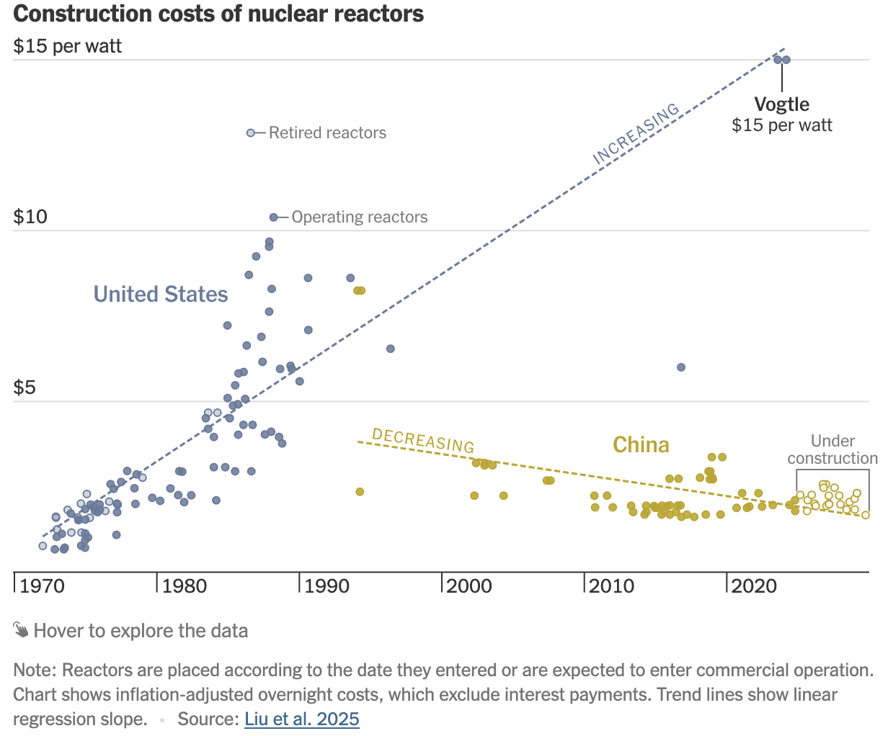

\vspace{-2.5cm}

## Nuclear reactor costs

On October 22, 2025 the *New York Times* published the article "How China Raced Ahead of the U.S. on Nuclear Power". 

The article includes the following figure showing construction costs for US and Chinese nuclear reactors over time:

### Questions

Discuss these questions with a neighbor. You do not need to write anything down.

1. The broad conclusion from the article seems to be that China "has figured out how to produce reactors relatively quickly and cheaply", whereas costs in the US have "skyrocketed". Do you think that the figure supports these conclusions?

2. The lines shown on the plot are reported as linear regression lines. Do you see any problem with fitting these lines to the data? Would you do anything differently?

